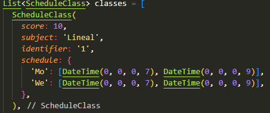
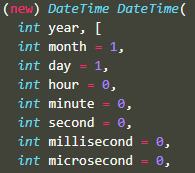
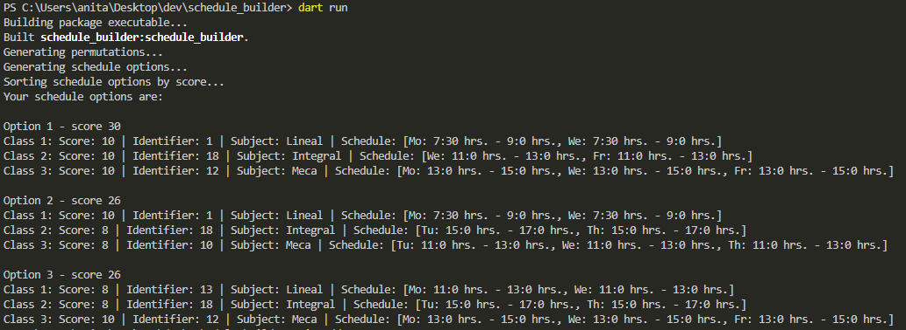

# Usage:
1. Modify the List of ScheduleClass variable (named 'classes') to adjust it according to your requirements.

## Details on filling ScheduleClass instances
* Score is an integer used to prioritize built schedules, my recommendation is to keep them with values from (1, 10).
* Subject is a string that represents an unique identifier for each subject, it does not matter which one you use as long as you use the same tag for all ScheduleClass instances reffering the same subject. Eg. 'Math', 'Architecture', etc.
* Identifier represents the group of the class, eg. '1', '1CM2', etc.
* Days of week have to be chosen among the next list of values: ['Su', 'Mo', 'Tu', 'We', 'Th', 'Fr', 'Sa']
* The two DateTimes of each day represent Start time and End time of each day, they have to be filled according to the specification of DateTime class filling values only for hour and minutes (if minutes are required to be specified).

2. Execute 'dart run' from project root opened cmd console.

# Installation:
1. Install flutter.

# Output:
