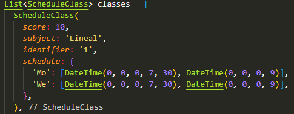

# Usage:
1. Modify the List of ScheduleClass variable (named 'classes') to adjust it according to your requirements.

2. Execute 'dart run' from project root opened cmd console.

# Installation:
1. Install flutter.

# Output:
